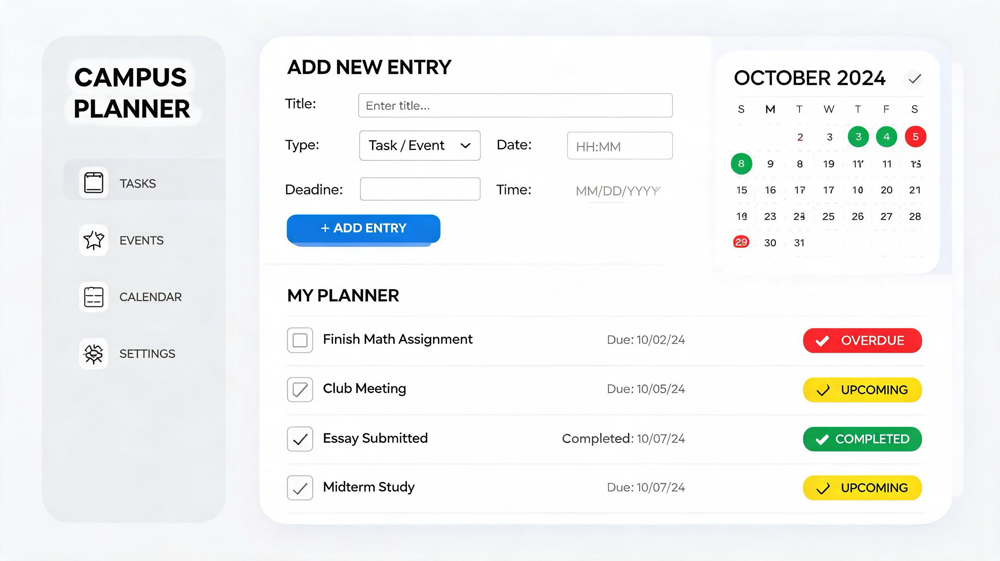

# Campus-Life Planner

A responsive single-page-style web app for managing academic tasks and events. Built with vanilla HTML, CSS, and JavaScript — no frameworks or build tools required.

---

## Features

- **Dashboard** — overview of all entries (tasks + events) with live counts
- **Tasks page** — filtered view showing only tasks
- **Events page** — filtered view showing only events
- **Create / Edit / Delete** entries via a modal dialog
- **Search** — real-time filtering with matched text highlighted
- **Sort** — by title, status, due date, or due time
- **Persistent storage** — entries saved to `localStorage`; seeded from `seed.json` on first load
- **Responsive layout** — side nav on large screens, fixed bottom nav on small screens (≤ 1024px)
- **Active nav highlighting** — current page indicated visually in the nav
- **Form validation** — title required; due date and time cannot be in the past

---

## Project Structure

```
.
├── index.html              # Dashboard page
├── tasks_page.html         # Tasks page
├── events_page.html        # Events page
├── settings.html           # Settings page
├── seed.json               # Initial seed data (loaded once into localStorage)
├── styles/
│   └── index.css           # All styles including responsive breakpoints
└── scripts/
    ├── script_index.js     # Dashboard logic (all entries)
    ├── script_tasks.js     # Tasks page logic
    └── script_events.js    # Events page logic
```

---

## Entry Data Model

Each entry stored in `localStorage` follows this shape:

| Field       | Type   | Values                                                  |
| ----------- | ------ | ------------------------------------------------------- |
| `id`        | string | UUID generated via `crypto.randomUUID()`                |
| `title`     | string | Any non-empty string                                    |
| `tag`       | string | `"task"` or `"event"`                                   |
| `status`    | string | `"not-started"`, `"in-progress"`, `"done"`, `"overdue"` |
| `dueDate`   | string | `"YYYY-MM-DD"` or `""` if unset                         |
| `dueTime`   | string | `"HH:MM"` or `""` if unset                              |
| `createdAt` | number | Unix timestamp (`Date.now()`)                           |

---

## Getting Started

No installation or build step needed. Open any page directly in a browser:

To acess the project locally, you can use live server extension in the IDE

To access it online use the link: https://umutesimma.github.io/alu-responsive_ui_summative/

> `seed.json` is loaded via `fetch()`, which requires a server (or a browser that allows local file fetches). On first load with an empty `localStorage`, the seed data is written automatically.

---

## Responsive Behaviour

| Screen width | Nav layout                    | Title location      |
| ------------ | ----------------------------- | ------------------- |
| > 1024px     | Vertical side panel           | Inside nav          |
| ≤ 1024px     | Fixed bottom bar (icons only) | Top of main content |

---

## Dependencies

| Dependency                              | Version | Usage           |
| --------------------------------------- | ------- | --------------- |
| [Font Awesome](https://fontawesome.com) | 7.0.1   | Nav icons (CDN) |

No other external dependencies.

---

## localStorage

All data lives under the key `planner_entries` as a JSON array. To reset to seed data, clear `localStorage` in browser DevTools:

```js
localStorage.removeItem("planner_entries");
```

Then reload the page.

## Demo:

Link: https://youtu.be/pfWMOvc94h4

## AI usage

In this project AI was used in the following areas:

- Bring out the UI visualisation to life. The image generated that was used for the inspo is attached below:
  
- To help in generating items for the seed.json file
- Structuring and refining this readme file to be of a good standard.
